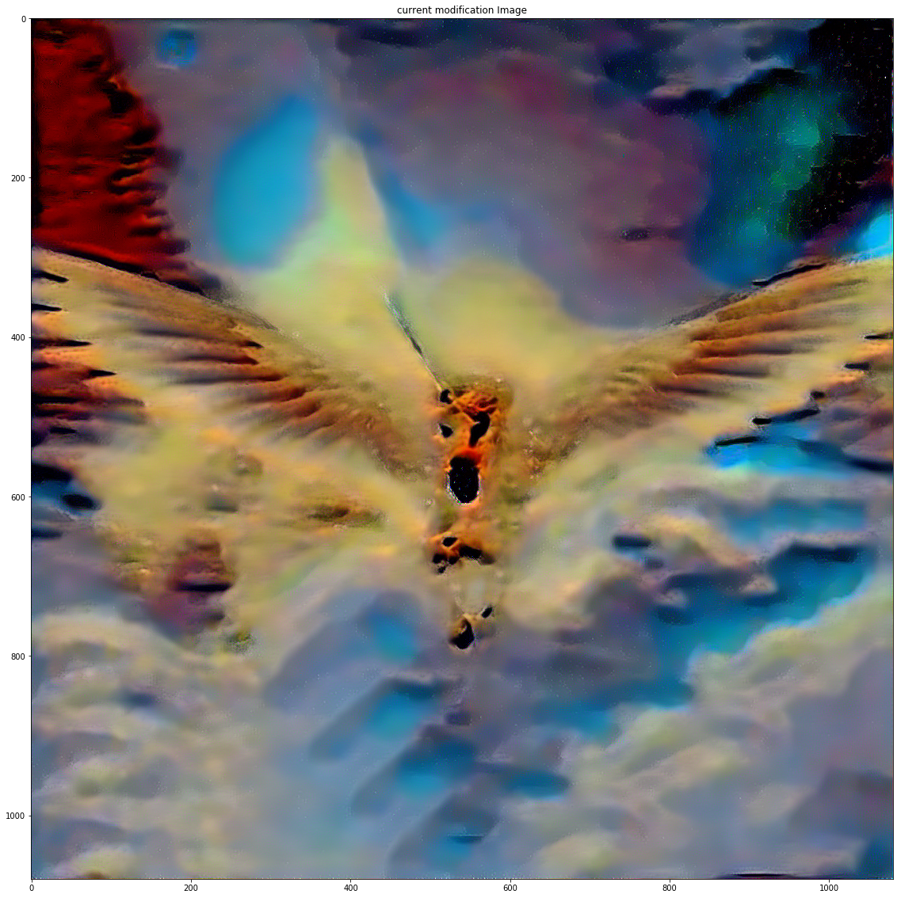

 ## trained on kagggle
 ## Import required modules

---

### [#1]


```python
import os
from distutils.dir_util import copy_tree
copy_tree("../input/vgg19dcbb9e9dpth/","/tmp/checkpoints")
os.environ['TORCH_HOME'] = '/tmp'
import torch
import torch.nn as nn
import torch.nn.functional as F
import torch.optim as optim
import numpy as np
from PIL import Image
import matplotlib.pyplot as plt
import torchvision.transforms as transforms
import torchvision.models as models
%pylab inline
pylab.rcParams['figure.figsize'] = (20, 20)
import copy
device = torch.device("cuda" if torch.cuda.is_available() else "cpu")
pylab.rcParams['figure.figsize'] = (20, 20)
```
# Setting paramater for optimization

## 

---

### [#2]


```python
#imsize = 2048 if torch.cuda.is_available() else 480
#this reduces the image quality in case a gpu is unavailable
imsize = 2048 if torch.cuda.is_available() else 1080

loader = transforms.Compose([
    transforms.Scale(imsize),# scale imported image
    transforms.CenterCrop(imsize),
    transforms.ToTensor()])  # transform it into a torch tensor

def image_loader(image_name):
    image = Image.open(image_name)
    # fake batch dimension required to fit network's input dimensions
    image = loader(image).unsqueeze(0)
    return image.to(device, torch.float)


style_img = image_loader(r"/kaggle/input/picture/Beautiful-Computer-Wallpaper-HD-1080p.jpg")
content_img = image_loader(r"//kaggle/input/picture/unicorn-desktop-wallpaper-fantasy-art-pure-mythology-high-quality-2.jpg")
print(style_img.size(),content_img.size())

assert(style_img.size() == content_img.size())
```

---

### [#3]


```python
unloader = transforms.ToPILImage()  # reconvert into PIL image

plt.ion()

def imshow(tensor, title=None):
    image = tensor.cpu().clone()  # we clone the tensor to not do changes on it
    image = image.squeeze(0)      # remove the fake batch dimension
    image = unloader(image)
    plt.imshow(image)
    if title is not None:
        plt.title(title)
    plt.pause(0.001) # pause a bit so that plots are updated


    
plt.figure()
imshow(style_img, title='Style Image')

plt.figure()
imshow(content_img, title='Content Image')
```


---

### [#4]


```python

```
Output:

    [style_img]


  [content_img]


 ## define a filter to any (m x n) dimension as edge_detection

---

### [#5]


```python
class ContentLoss(nn.Module):

    def __init__(self, target,):
        super(ContentLoss, self).__init__()
        # we 'detach' the target content from the tree used
        # to dynamically compute the gradient: this is a stated value,
        # not a variable. Otherwise the forward method of the criterion
        # will throw an error.
        self.target = target.detach()

    def forward(self, input):
        self.loss = F.mse_loss(input, self.target)
        return input
def gram_matrix(input):
    a, b, c, d = input.size()  # a=batch size(=1)
    # b=number of feature maps
# (c,d)=dimensions of a f. map (N=c*d)

    features = input.view(a * b, c * d)  # resise F_XL into \hat F_XL

    G = torch.mm(features, features.t())  # compute the gram product

    # we 'normalize' the values of the gram matrix
    # by dividing by the number of element in each feature maps.
    return G.div(a * b * c * d)
class StyleLoss(nn.Module):

    def __init__(self, target_feature):
        super(StyleLoss, self).__init__()
        self.target = gram_matrix(target_feature).detach()

    def forward(self, input):
        G = gram_matrix(input)
        self.loss = F.mse_loss(G, self.target)
        return input
class Normalization(nn.Module):
    def __init__(self, mean, std):
        super(Normalization, self).__init__()
        # .view the mean and std to make them [C x 1 x 1] so that they can
        # directly work with image Tensor of shape [B x C x H x W].
        # B is batch size. C is number of channels. H is height 
        self.mean = torch.tensor(mean).view(-1, 1, 1)
        self.std = torch.tensor(std).view(-1, 1, 1)

    def forward(self, img):
        # normalize img
        return (img - self.mean) / self.std
    # desired depth layers to compute style/content losses :
content_layers_default = ['conv_4']
style_layers_default = ['conv_1', 'conv_2', 'conv_3', 'conv_4', 'conv_5']
def get_style_model_and_losses(cnn, normalization_mean, normalization_std,
                               style_img, content_img,
                               content_layers=content_layers_default,
                               style_layers=style_layers_default):
        cnn = copy.deepcopy(cnn)

        # normalization module
        normalization = Normalization(normalization_mean, normalization_std).to(device)

        # just in order to have an iterable access to or list of content/syle
        # losses
        content_losses = []
        style_losses = []
         model = nn.Sequential(normalization)
    i = 0  # increment every time we see a conv
    for layer in cnn.children():
        if isinstance(layer, nn.Conv2d):
            i += 1
            name = 'conv_{}'.format(i)
        elif isinstance(layer, nn.ReLU):
            name = 'relu_{}'.format(i)
            # The in-place version doesn't play very nicely with the ContentLoss
            # and StyleLoss we insert below. So we replace with out-of-place
            # ones here.
            layer = nn.ReLU(inplace=False)
        elif isinstance(layer, nn.MaxPool2d):
            name = 'pool_{}'.format(i)
        elif isinstance(layer, nn.BatchNorm2d):
            name = 'bn_{}'.format(i)
        else:
            raise RuntimeError('Unrecognized layer: {}'.format(layer.__class__.__name__))
        model.add_module(name, layer)

        if name in content_layers:
            # add content loss:
            target = model(content_img).detach()
            content_loss = ContentLoss(target)
            model.add_module("content_loss_{}".format(i), content_loss)
            content_losses.append(content_loss)
        if name in style_layers:
            # add style loss:
            target_feature = model(style_img).detach()
            style_loss = StyleLoss(target_feature)
            model.add_module("style_loss_{}".format(i), style_loss)
            style_losses.append(style_loss)

    # now we trim off the layers after the last content and style losses
    for i in range(len(model) - 1, -1, -1):
        if isinstance(model[i], ContentLoss) or isinstance(model[i], StyleLoss):
            break

    model = model[:(i + 1)]

    return model, style_losses, content_losses
input_img = content_img.clone()
# if you want to use white noise instead uncomment the below line:
# input_img = torch.randn(content_img.data.size(), device=device)

# add the original input image to the figure:
plt.figure()
imshow(input_img)
```


---

### [#6]


```python
def get_input_optimizer(input_img):
    # this line to show that input is a parameter that requires a gradient
    optimizer = optim.LBFGS([input_img.requires_grad_()])
    return optimizer
def run_style_transfer(cnn, normalization_mean, normalization_std,
                       content_img, style_img, input_img, num_steps=300,
                       style_weight=1000000, content_weight=1):
    """Run the style transfer."""
    print('Building the style transfer model..')
    model, style_losses, content_losses = get_style_model_and_losses(cnn,normalization_mean, normalization_std, style_img, content_img)
    optimizer = get_input_optimizer(input_img)

    print('Optimizing..')
    run = [0]
    while run[0] <= num_steps:

        def closure():
            # correct the values of updated input image
            input_img.data.clamp_(0, 1)

            optimizer.zero_grad()
            model(input_img)
            style_score = 0
            content_score = 0

            for sl in style_losses:
                style_score += sl.loss
            for cl in content_losses:
                content_score += cl.loss

            style_score *= style_weight
            content_score *= content_weight
            loss = style_score + content_score
            loss.backward()
            run[0] += 1
            if run[0] % 50 == 0:
                print("run {}:".format(run))
                print('Style Loss : {:4f} Content Loss: {:4f}'.format(
                    style_score.item(), content_score.item()))
                print()
                imshow(input_img, title='current modification Image')

            return style_score + content_score

        optimizer.step(closure)

    # a last correction...
    input_img.data.clamp_(0, 1)

    return input_img
```
[]
```python
cnn = models.vgg19(pretrained=True).features.to(device).eval()
cnn_normalization_mean = torch.tensor([0.5, 0.5, 0.5])
cnn_normalization_std = torch.tensor([0.229, 0.224, 0.225])
output = run_style_transfer(cnn, cnn_normalization_mean, cnn_normalization_std,content_img, style_img, input_img,num_steps=800)
plt.figure()
imshow(output, title='Output Image')

# sphinx_gallery_thumbnail_number = 4
plt.ioff()
plt.show()
```

Output:

Optimizing..
run [50]:
Style Loss : 259.097107 Content Loss: 4.290390


---

run [100]:
Style Loss : 179.582535 Content Loss: 5.312847




---


run [150]:
Style Loss : 87.066132 Content Loss: 6.564795


---


run [200]:
Style Loss : 20.309290 Content Loss: 5.657081


---


run [250]:
Style Loss : 10.864233 Content Loss: 4.735281


---

run [300]:
Style Loss : 7.285984 Content Loss: 4.068372


---


run [350]:
Style Loss : 5.060086 Content Loss: 3.667866


---

run [400]:
Style Loss : 3.686680 Content Loss: 3.429209


---


run [450]:
Style Loss : 2.733267 Content Loss: 3.259518


---

run [500]:
Style Loss : 1.996152 Content Loss: 3.139938


---

run [550]:
Style Loss : 1.502804 Content Loss: 3.055034


---

run [600]:
Style Loss : 1.131459 Content Loss: 3.011957


---

run [650]:
Style Loss : 0.853874 Content Loss: 2.961558


---

run [700]:
Style Loss : 0.653365 Content Loss: 2.888459


---

run [750]:
Style Loss : 0.530083 Content Loss: 2.789802


---

run [800]:
Style Loss : 0.445384 Content Loss: 2.696638


---

